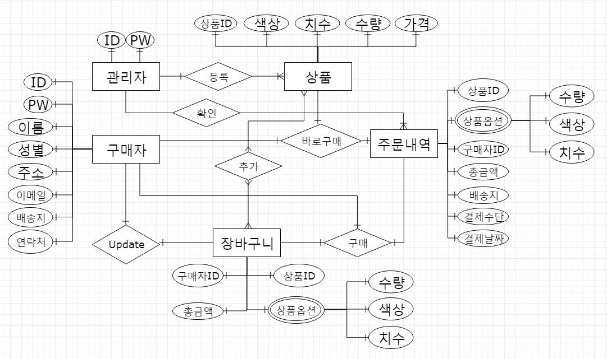

## HUFS-GOODS
한국외국어대학교 융복합소프트웨어 전공의 데이터베이스 
팀 프로젝트의 일환으로, 학교의 굿즈를 판매하는 쇼핑몰을 구현한다.
  

### Skill set
**Language**: node.js  
**Framework**: express.js  
**Database**: MongoDB  
**Third-party Libraries**: 
- express-session
- express-validator
- passport.js
- connecnt-flash
- csurf
  

### Deploy
  

### ERD

- User
- Product
- Cart
- Order